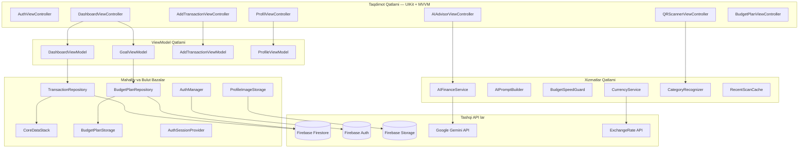
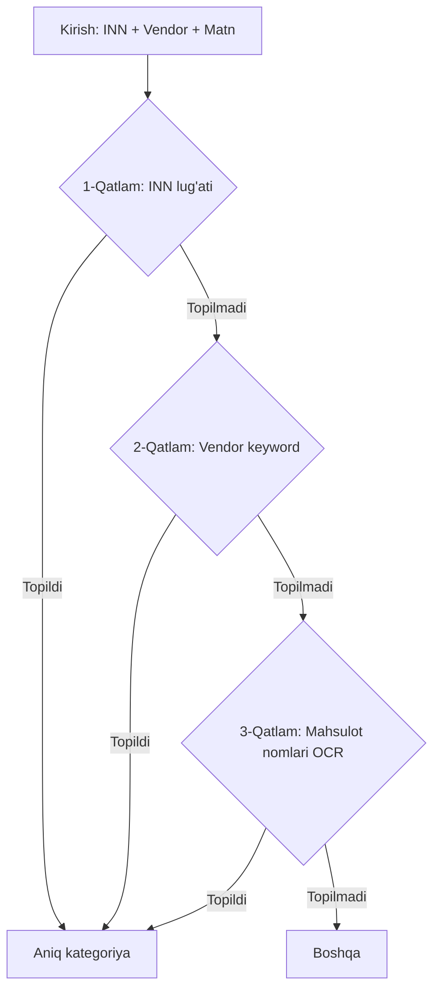
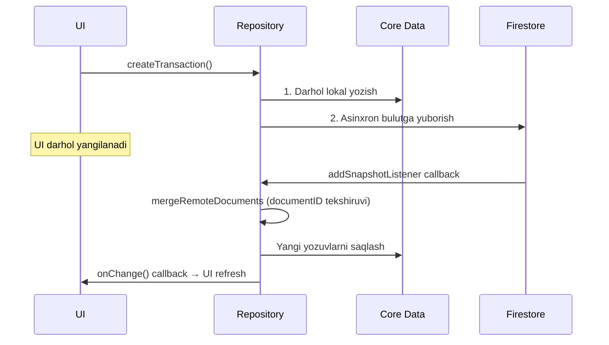

# SmartFinance 🚀

**iOS uchun aqlli moliyaviy boshqaruv ilovasi**

SmartFinance — foydalanuvchilarga daromad va xarajatlarini kuzatish, byudjet rejalashtirish, QR/OCR orqali cheklar skanerlash va sun'iy intellekt (Google Gemini AI) yordamida moliyaviy maslahatlar olish imkonini beruvchi to'liq funksional iOS ilovasi.

> **Texnologiyalar:** Swift 5 · UIKit · MVVM · Core Data · Firebase (Auth, Firestore, Storage) · Google Gemini AI · DGCharts · Vision · AVFoundation · ESTabBarController

---

## 📐 Arxitektura

Ilova **MVVM + Repository Pattern** arxitekturasida qurilgan. Quyidagi diagramma barcha qatlamlar va ularning bog'liqliklarini ko'rsatadi:



---

## 📂 Loyiha Strukturasi

```text
SmartFinance/
│
├── 📄 AuthManager.swift              # Firebase Auth boshqaruvi (Singleton)
├── 📄 AuthViewController.swift       # Login/Register/Google/Guest UI
│
├── 📁 Data/
│   ├── Auth/
│   │   └── AuthSessionProvider.swift      # UID ni protokol orqali abstraksiya
│   ├── Persistence/
│   │   └── CoreDataStack.swift            # NSPersistentContainer wrapper
│   ├── Repositories/
│   │   ├── TransactionRepository.swift    # Tranzaksiya CRUD + Firestore sync
│   │   └── BudgetPlanRepository.swift     # Byudjet CRUD + Firestore sync
│   └── Storage/
│       └── ProfileImageStorage.swift      # Firebase Storage ga rasm yuklash
│
├── 📁 Services/
│   ├── BudgetSpeedGuard.swift        # Xarajat tezligi algoritmi
│   ├── CategoryRecognizer.swift      # 3-qatlamli kategoriya aniqlash
│   ├── CurrencyService.swift         # Real-time valyuta kurslari
│   ├── RecentScanCache.swift         # Dublikat chek oldini olish
│   └── FirestoreService.swift        # Umumiy Firestore yordamchi
│
├── 📁 ViewModels/
│   ├── AIAdvisorViewController.swift     # AI chat interfeysi + logika
│   ├── AIFinanceService.swift            # Gemini API REST client
│   ├── AIPromptBuilder.swift             # Kontekstli prompt generatori
│   └── DateRangePickerViewController.swift
│
├── 📁 Views/
│   ├── MainTabBarController.swift             # 3-tabli navigatsiya
│   ├── DashboardViewController.swift          # Asosiy ekran + grafik
│   ├── DashboardViewController+TableView.swift
│   ├── DashboardViewController+search.swift   # Qidiruv + Filtrlar
│   ├── AddTransactionViewController.swift     # Tranzaksiya qo'shish
│   ├── QRScannerViewController.swift          # QR + OCR skaner
│   ├── ScanResultBottomSheetVC.swift          # Skan natijasi
│   ├── ProfilViewController.swift             # Profil sahifasi
│   └── Planning/
│       ├── BudgetPlan.swift                   # Model + UserDefaults
│       ├── BudgetPlanViewController.swift     # Byudjet yaratish UI
│       ├── GoalViewModel.swift                # Byudjet biznes logikasi
│       ├── GoalCardView.swift                 # Dashboard karta
│       └── DashboardViewController+Goals.swift
│
├── 📁 Domain/
│   ├── Models/           # Core Data entity modellari
│   └── Search/           # Qidiruv logikasi
│
├── 📁 Presentation/
│   ├── Dashboard/        # Dashboard yordamchi sinflari
│   └── ViewModels/       # DashboardViewModel
│
└── SmartFinance.xcdatamodeld   # Core Data sxemasi
```

---

## 🔐 Modul 1: Autentifikatsiya

**Fayl:** `AuthManager.swift` · 306 qator · **Singleton**

### Kirish usullari (4 ta):

| # | Kirish usuli | Texnik amalga oshirish |
|---|-------------|----------------------|
| 1 | **Email/Parol** bilan kirish | `Auth.auth().signIn(withEmail:password:)` |
| 2 | **Google Sign-In** | `GIDSignIn` → `GoogleAuthProvider.credential()` → `Auth.auth().signIn(with:)` |
| 3 | **Mehmon (Anonim)** kirish | `Auth.auth().signInAnonymously()` |
| 4 | **Anonim → Google** birlashtirish | `currentUser.link(with: credential)` — mavjud ma'lumotlar saqlanadi |

### Boshqaruv funksiyalari (3 ta):

| # | Funksiya | Texnik amalga oshirish |
|---|----------|----------------------|
| 1 | Ro'yxatdan o'tish (Register) | `Auth.auth().createUser()` + parol validatsiyasi |
| 2 | Parolni tiklash | `Auth.auth().sendPasswordReset(withEmail:)` |
| 3 | Chiqish (Logout) | `Auth.auth().signOut()` + `GIDSignIn.sharedInstance.signOut()` |

### Parol Validatsiyasi (Regex):
- Kamida **8 belgi** · Kamida **1 katta harf** `[A-Z]` · Kamida **1 raqam** `[0-9]`

### Real-time Parol Kuchi:
| Ball | Daraja | Rang |
|------|--------|------|
| 0-1 | Juda kuchsiz 🔴 | `systemRed` |
| 2 | O'rta 🟡 | `systemOrange` |
| 3 | Yaxshi 🟢 | `systemGreen` |
| 4 | A'lo 💪 | `systemBlue` |

### UI Komponentlari (AuthViewController — 666 qator):
- `AuthTextField` — Maxsus padding va styling bilan UITextField
- `EyeToggleButton` — Parolni ko'rish/yashirish tugmasi
- `DividerView` — "yoki" ajratuvchi chiziq
- `UIScrollView` asosida qurilgan, keyboard ni to'g'ri boshqaradi
- `NotificationCenter` orqali `SceneDelegate` ga signal yuboriladi (`.switchToMainApp`)

---

## 📊 Modul 2: Dashboard (Asosiy Ekran)

**Fayl:** `DashboardViewController.swift` · 518 qator

### Ekran tarkibi:
1. **Top Nav Bar** — Balans ko'rsatkichi + Qidiruv + "+" tugma
2. **Carousel (2 sahifa):**
   - 1-sahifa: `PieChartView` (DGCharts) — kategoriya bo'yicha donut grafik
   - 2-sahifa: `GoalCardView` — byudjet rejasi holati
3. **Vaqt navigatsiyasi** — Kun/Oy/Yil segmenti + oldingi/keyingi
4. **SmartBanner** — BudgetSpeedGuard ogohlantirishi
5. **Tranzaksiyalar jadvali** — sanaga guruhlangan

### Animatsiyalar:
- `animateChartTransition()` — Spring damping bilan silliq grafik o'tishi
- `UIImpactFeedbackGenerator` — Haptic feedback har bir navigatsiyada
- `carouselPageControl` — Sahifalar o'rtasida nuqtali ko'rsatkich

### Ma'lumot oqimi:
```
viewWillAppear()
  → viewModel.viewWillAppear()
      → TransactionRepository.startRemoteSync()   // Firestore listener yoqiladi
      → TransactionRepository.fetchTransactions()  // Core Data dan o'qish
  → loadGoalData()
      → GoalViewModel.load()
          → BudgetPlanRepository.loadPlan()         // Local + Firestore
          → BudgetPlanRepository.startRemoteSync()  // Real-time listener
  → onStateChanged callback
      → applyViewModelState()
          → Balans hisoblash (rang: yashil yoki qizil)
          → PieChart data yaratish
          → tableView.reloadData()
          → refreshGoalUI()
```

---

## 💰 Modul 3: Tranzaksiya Qo'shish

**Fayl:** `AddTransactionViewController.swift` · 789 qator

### Xususiyatlari:
- **Kirim/Chiqim toggle** — Animatsiyali slider (`UIView.animate` + spring damping)
- **7 valyuta:** UZS 🇺🇿, USD 🇺🇸, EUR 🇪🇺, RUB 🇷🇺, GBP 🇬🇧, CNY 🇨🇳, KZT 🇰🇿
- **Valyuta dropdown** — Animatsiyali ochilish/yopilish (height constraint)
- **Real-time konvertatsiya** — `≈ 128 500 so'm` formatida
- **7 kategoriya** — Emoji + ism bilan grid ko'rinishda
- **Shake animatsiya** — `CAKeyframeAnimation` bo'sh maydonlar uchun

### Saqlash jarayoni:
```
saveTapped()
  → amountInUZS = raw * selectedCurrency.rateToUZS   // Konvertatsiya
  → viewModel.save()
      → TransactionRepository.createTransaction()
          → 1. Core Data ga yozish (documentID generatsiya)
          → 2. Firestore ga setData (asinxron)
  → navigationController.popViewController()
```

---

## 💱 Modul 4: Valyuta Xizmati

**Fayl:** `CurrencyService.swift` · 165 qator · **Singleton**

### 4 bosqichli kurs olish:
```
1. In-memory kesh (1 soat TTL)    → Bor bo'lsa qaytarish
2. Tarmoq (open.er-api.com/v6)    → Muvaffaqiyatli → keshga yozish
3. UserDefaults (oxirgi kurslar)   → Offline bo'lsa
4. Hardcoded fallback (2025 baza)  → Hech narsa ishlamasa
```

### Kurs hisoblash:
```
API bazasi: USD
1 EUR = (UZS_per_USD / USD_per_EUR) UZS
Misol: 1 EUR = (12850 / 0.92) ≈ 13967 UZS
```

---

## 📷 Modul 5: QR Skaner va OCR

**Fayl:** `QRScannerViewController.swift` · 840 qator

### 2 rejim:

| Rejim | Texnologiya | Natija |
|-------|------------|--------|
| **QR Kod** | `AVCaptureMetadataOutput` (qr, ean13, ean8, code128) | URL → parse → ScannedExpense |
| **Chek rasmi** | `AVCapturePhotoOutput` + `VNRecognizeTextRequest` | Rasm → OCR → matn → parse |

### OCR Matn Tahlili (`parseReceiptText`):
1. **Do'kon nomi** — birinchi 6 qatorda bilgan do'konlarni qidirish
2. **Summa** — `"to'lov uchun"`, `"jami"`, `"итого"` kalit so'zlar yonidagi raqam
3. **Sana** — 5 xil format: `dd/MM/yyyy HH:mm:ss`, `dd.MM.yyyy` va h.k.
4. **Kategoriya** — `CategoryRecognizer` orqali 3-qatlamli aniqlash

### Dublikat Himoyasi (`RecentScanCache`):
- **Key formati:** `"korzinka_19549_2026-4-22-14-30"`
- **TTL:** 24 soat — shu vaqt ichida bir xil chek qayta saqlanmaydi
- Foydalanuvchiga `"⚠️ Takroriy chek"` ogohlantirishi ko'rsatiladi

### Kamera boshqaruvi:
- Flash on/off (`device.torchMode`)
- Galereyadan rasm tanlash (`UIImagePickerController`)
- OCR tillari: `["uz", "ru", "en"]`
- `isProcessingQR` flag — bir QR bir necha marta ishlanishini oldini oladi

---

## 🧠 Modul 6: Kategoriya Aniqlash

**Fayl:** `CategoryRecognizer.swift` · 224 qator

### 3-qatlamli algoritm:



**1-Qatlam — INN lug'ati:**
| INN | Vendor | Kategoriya |
|-----|--------|-----------|
| 207229526 | Korzinka | Oziq-ovqat |
| 301386376 | Makro | Oziq-ovqat |
| 310600000 | Artel | Elektronika |
| 200430555 | UzAuto | Transport |

**2-Qatlam — Do'kon nomi keyword:** `"taxi"` → Transport, `"apteka"` → Dorixona

**3-Qatlam — Mahsulot nomlari:** 200+ kalit so'z (o'zbek + rus tilida):
- `"kartoshka"`, `"sut"`, `"non"` → Oziq-ovqat
- `"futbolka"`, `"poyabzal"` → Kiyim
- `"paracetamol"`, `"vitamin"` → Dorixona

---

## 🤖 Modul 7: AI Moliyaviy Maslahatchi

### AIPromptBuilder (107 qator):
Tranzaksiyalardan `FinancialSummary` tuzadi:
- `totalIncome`, `totalExpense`, `balance`
- `categoryBreakdown` — har bir kategoriya foizi
- `budgetWarning` — BudgetSpeedGuard natijasi

### AIFinanceService (165 qator):
- **Model:** `gemini-2.5-flash`
- **API kaliti ketma-ketligi:** `GeminiSecrets.plist` → `Info.plist` → xato
- **System prompt qoidalari:** Faqat moliya, faqat o'zbek tili, 3-5 gap, aniq raqamlar

### AIAdvisorViewController (685 qator) — Chat interfeysi:
- **8 ta tayyor savol:** "Umumiy tahlil", "Qanday tejay?", "Xavfli xarajatlar", "Kelasi oy rejasi"...
- **Bubble-style xabarlar:** `UserMessageCell` (ko'k, o'ngda) va `AIMessageCell` (kulrang, chapda, avatar bilan)
- **TypingIndicatorView** — 3 nuqtali pulsatsiya animatsiyasi
- **Keyboard handling** — `inputBarBottomConstraint` bilan inputBar harakatlanadi

---

## ⚡ Modul 8: BudgetSpeedGuard

**Fayl:** `BudgetSpeedGuard.swift` · 46 qator

### Algoritm:
```
dynamicDailyLimit = currentBalance / remainingDays
averageDailyExpense = totalExpense / dayOfMonth

Qoida 1: balans < 0 → 🚨 "Balansingiz minusda!"
Qoida 2: averageDailyExpense > dynamicDailyLimit
  → predictedDaysLeft = currentBalance / averageDailyExpense
  → ⚠️ "Shu tezlikda pulingiz X kunda tugaydi"
Aks holda: ✅ "Xarajat me'yorda. Kunlik limit: X so'm"
```

---

## 📅 Modul 9: Byudjet Rejalashtirish

### BudgetPlan modeli (132 qator):
```swift
struct BudgetPlan: Codable {
    var totalAmount: Double         // Umumiy byudjet
    var startDate, endDate: Date    // Muddat
    var categoryLimits: [CategoryLimit]

    // Hisoblangan:
    var remainingDays: Int          // Qolgan kunlar
    var isExpired: Bool             // Muddat tugaganmi
    var timeProgressPercent: Double // Vaqt foizi
    var unallocated: Double         // Taqsimlanmagan pul
}
```

### GoalViewModel (149 qator):
- `load()` — Local cache + Firestore one-shot + Real-time listener
- `syncSpent()` — Tranzaksiyalardan haqiqiy sarfni hisoblash
- `warningCategories` — `percentSpent >= 80%` → ⚠️ Ogohlantirish
- `overBudgetCategories` — `spent > limit` → 🚨 Oshib ketdi

### BudgetPlanStorage — 3 qatlamli saqlash:
```
UserDefaults (key: "sf_budget_plan_v3_{userID}")
  + Firestore (collection: "budgetPlans", document: uid)
  + Legacy migratsiya (v2 → v3 avtomatik)
```

---

## 🔄 Modul 10: Ma'lumotlar Sinxronizatsiyasi

### TransactionRepository (159 qator):



### Merge logikasi:
- Har bir Firestore hujjat uchun `documentID` bo'yicha Core Data da qidiriladi
- Agar lokal nusxa **mavjud bo'lsa** — o'tkazib yuboriladi (dublikat oldini olish)
- Agar **yangi bo'lsa** — Core Data ga yoziladi va context saqlanadi

---

## 🎨 Modul 11: Tab Bar Navigatsiya

**Fayl:** `MainTabBarController.swift` · 129 qator · `ESTabBarController`

| Tab | Ekran | Ikonka | Animatsiya |
|-----|-------|--------|-----------|
| 1 | Dashboard | 🏠 house.fill | Standart |
| 2 | QR Skaner | 📷 Markaziy katta tugma | Bounce (sakrash) |
| 3 | Profil | 👤 person.fill | Standart |

- `ExampleBouncesContentView` — Markaziy tugma `60px` diametrli, teal rangda, tepaga `15px` chiqarilgan
- `CAKeyframeAnimation` — Bosishda `[1.0, 0.94, 1.05, 0.98, 1.01, 1.0]` qiymatlari bilan sakrash

---

## 👤 Modul 12: Profil

**Fayl:** `ProfilViewController.swift` · 497 qator

- **Profil rasmi** — `UIImagePickerController` → `ProfileImageStorage` → Firebase Storage
- **Hisob ma'lumotlari:** Ism, Email, UID (12 belgigacha), Hisob turi
- **Hisob turi ranglari:** Email/Parol 🟢, Google 🔵, Mehmon 🟠
- **AI Maslahatchi kartasi** — Bosish → `AIAdvisorViewController` modal ochiladi
- **Logout** — `ActionSheet` → `AuthManager.signOut()` → lokal tozalash → Auth ekraniga

---

## 🛠 Kutubxonalar

| Kutubxona | Maqsad | Ishlatilgan joy |
|-----------|--------|-----------------|
| **Firebase Auth** | Identifikatsiya | `AuthManager` |
| **Firestore** | Bulut baza | `TransactionRepository`, `BudgetPlanRepository` |
| **Firebase Storage** | Rasm saqlash | `ProfileImageStorage` |
| **Google Sign-In** | OAuth | `AuthManager.signInWithGoogle()` |
| **Core Data** | Lokal baza | `CoreDataStack`, `Transaction` entity |
| **DGCharts** | Grafiklar | `DashboardVC` — PieChartView |
| **Vision** | OCR | `QRScannerVC` — VNRecognizeTextRequest |
| **AVFoundation** | Kamera | `QRScannerVC` — QR + Photo |
| **ESTabBarController** | Tab bar | `MainTabBarController` |

---

## 🔒 Xavfsizlik

- API kalitlari `.gitignore` dagi `GeminiSecrets.plist` da saqlanadi
- Firestore — faqat o'z `userID` si bo'yicha yozish/o'qish
- Parol kuchi real-time tekshiriladi (Regex)
- Anonim → Google linking — mehmon ma'lumotlari yo'qolmaydi

---

## 🚀 O'rnatish

```bash
git clone [repository-url]
cd SmartFinance
pod install

# GoogleService-Info.plist ni SmartFinance/ ga qo'ying
# GeminiSecrets.plist.example → GeminiSecrets.plist nusxalang
# GeminiAPIKey qiymatini Google AI Studio dan oling

open SmartFinance.xcworkspace  # Xcode da ⌘R
```

---

*Muallif: Diyorbek Xikmatullayev · 2026*
